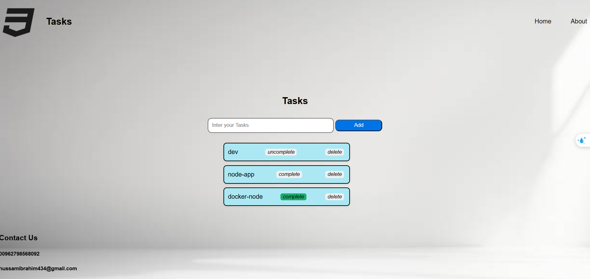

# My-Tasks
##About what i learned

I’ve learned how HTML, CSS, and JavaScript work together to create interactive and visually appealing web pages. One key observation is how small changes in CSS or JavaScript can significantly affect layout or functionality. I also realized how important it is to organize code clearly and consistently.

##How did long it take to complete

It took me between 5 to 6 hours to complete this assignment. I originally expected it to take about 2 to 4 hours, but I spent extra time working through styling issues, debugging JavaScript functions, and improving the overall user interface.

# Wireframe

### Home page

### About page

### life home page 

### life about page

